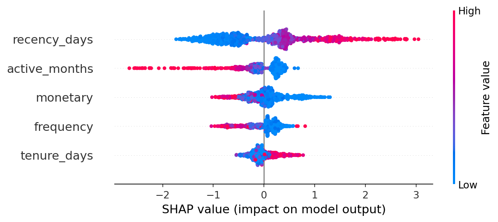

# E-Commerce Retail Analytics & Churn Prediction (SQL + Machine Learning)

**Tools:** PostgreSQL · Python · scikit-learn · XGBoost · SHAP · DBeaver
**Dataset:** UCI Online Retail II: 1,067,371 transactions · Dec 2009 – Dec 2011  
**Domain:** UK-based online gift and homeware wholesaler  

---

## Executive Summary

Analysis of 1,003,469 transactions across 5,862 customers reveals a business at a strategic inflection point.

- **Revenue grows steadily year-on-year** — 2010 revenue £9.41M, 2011 revenue £9.47M, a marginal +0.7% growth on flat Q1-Q2 performance offset by strong H2
- **Retention drives 73%+ of revenue** — loyal customers (10+ orders, 16.4% of base) generate 73% of total revenue at £14,589 average LTV
- **New customer acquisition declining** — new customers fell from 382/month in early 2010 to 101–108/month by mid-2011; December 2011 saw only 28 new customers
- **£1M in high-value customers is at risk** — Champions-tier customers averaging £4,353 lifetime spend have not purchased in 344 days on average; targeted win-back could recover ~£260,000
- **International revenue is dangerously concentrated** — one customer accounts for 95.8% of Netherlands revenue and 85.8% of Australian revenue; losing either account would effectively end those markets

---

## Project Overview

End-to-end analytics and machine learning project on a real-world transactional dataset. The project covers the full analyst workflow: raw data ingestion, data quality profiling, revenue analysis, customer behaviour, cohort retention, RFM segmentation, advanced business intelligence, and a churn prediction model using XGBoost with SHAP explainability.

The dataset represents a UK-based online gift retailer selling primarily to wholesale trade buyers across 43 countries. All findings are interpreted through a business lens with actionable recommendations throughout.

---

## Repository Structure

```
├── 01_load_data.py                # Python ingestion script 
├── 02_data_quality.sql            # Data profiling and clean dataset definition
├── 03_revenue_sales.sql           # Revenue trends, seasonality, geography, products
├── 04_customer_behaviour.sql      # Segmentation, frequency, retention, LTV
├── 05_cohort_retention.sql        # Monthly cohort retention matrix
├── 06_rfm_segmentation.sql        # RFM scoring and named segment assignment
├── 07_advanced_analysis.sql       # LTV projection, market basket, concentration risk
├── 08_ml_churn.py                 # Churn prediction model (XGBoost + SHAP)
├── shap_summary.png               # SHAP feature importance plot
├── feature_importance.png         # XGBoost gain-based feature importance
├── .env.example                   # Environment variable template
├── .gitignore                     # Excludes .env and data files
└── README.md
```

---

## Technical Stack

| Tool | Purpose |
|---|---|
| PostgreSQL 16 | Primary analytical database |
| Python 3 (pandas, psycopg2, openpyxl) | Data ingestion and loading |
| DBeaver | SQL client and query execution |

**SQL techniques demonstrated:** Window functions (RANK, NTILE, LAG, ROW_NUMBER, SUM OVER), multi-layer CTEs, self-joins for market basket analysis, conditional aggregation, date arithmetic, percentile functions, pivot via CASE WHEN aggregation.

---

## Dataset & Data Quality

**Raw dataset:** 1,067,371 rows across two Excel sheets (2009–2010 and 2010–2011).

**Data quality issues identified and resolved:**

| Issue | Count | Action |
|---|---|---|
| Missing customer_id (guest transactions) | 243,007 rows (22.77%) | Excluded from customer analysis |
| Cancellation invoices (prefix 'C') | 8,292 invoices reversing £1,526,667 | Excluded |
| Duplicate rows | 24,649 surviving deduplication | DISTINCT applied in view |
| Zero/negative price rows | 6,220 rows | Excluded |
| Non-product stock codes | 13 codes (POST, DOT, M, B, D, S…) | Excluded |

**Clean dataset (view `clean_transactions`):**

| Metric | Value |
|---|---|
| Rows | 1,003,469 |
| Customers | 5,862 |
| Invoices | 39,568 |
| Products | 4,906 |
| Total Revenue | £19,675,940 |
| Date Range | Dec 2009 – Dec 2011 (25 months) |
```

---

## Key Findings

### 1. Revenue & Seasonality

The business has a strong and consistent seasonal pattern driven by Christmas gifting demand. Revenue peaks in October and November each year then collapses ~50% post-Christmas into January/February.

| Period | Revenue 2010 | Revenue 2011 | YoY Change |
|---|---|---|---|
| January | £537,342 | £562,683 | +4.7% |
| April | £585,150 | £454,441 | **-22.3%** |
| September | £805,545 | £938,753 | **+16.5%** |
| November | £1,155,978 | £1,136,534 | -1.7% |

Full-year 2011 revenue was virtually identical to 2010 (£8.17M vs £8.22M) — flat growth driven by a weak Q1-Q2 offset by a strong H2. By November cumulative revenues differed by less than £2,000 across the two years.

**B2B wholesale signals:** Thursday accounts for the highest invoice count and revenue. Saturday has fewer than 30 invoices across the entire 2-year period. This is not a consumer retail operation.

**Note:** Section-level figures in Key Findings (RFM, geography, cohort retention, monthly revenue) reflect the original analysis run. Dataset version differences may produce slightly different outputs when re-running queries.

---

### 2. Customer Behaviour

**Order frequency drives revenue exponentially:**

| Segment | Customers | % Customers | Total Revenue | % Revenue | Avg LTV |
|---|---|---|---|---|---|
| One-time (1 order) | 1,625 | 27.7% | £556,149 | 2.8% | £342 |
| Occasional (2–4) | 2,094 | 35.7% | £2,190,065 | 11.1% | £1,046 |
| Regular (5–9) | 1,180 | 20.1% | £2,872,499 | 14.6% | £2,434 |
| Loyal (10+) | 963 | 16.4% | £14,057,228 | **71.4%** | £14,589 |

A loyal customer (£14,589 average LTV) is worth **43x** a one-time buyer (£342). The 27.7% one-time buyer rate represents a significant retention challenge. These customers generated only 2.8% of total revenue.

**Repurchase behaviour:** 72.3% of customers made a second purchase. New customer acquisition declined significantly over the dataset period, from ~380/month in early 2010 to ~100/month by mid-2011, indicating the business transitioned from acquisition-led to retention-led growth within 12 months.

---

### 3. Cohort Retention

Monthly cohort retention matrix built entirely in SQL tracking 25 acquisition cohorts from December 2009 through December 2011.

**December 2009 founding cohort (953 customers)** shows exceptional retention. Monthly activity of 33-49% is maintained across the full 2-year window, stabilising at 25-31% through months 13-24. This cohort is the commercial backbone of the business.

**Average retention curve across all cohorts:**

| Month | Avg Retention |
|---|---|
| Month 1 | 21.0% |
| Month 3 | 21.7% |
| Month 6 | 17.9% |
| Month 9 | 15.3% |
| Month 12 | 18.2% |

The curve flattens after month 3 rather than continuing to decay. Customers who survive early churn become long-term accounts active at a consistent 15-20% monthly rate for 2+ years.

**Seasonal reactivation:** Almost every cohort shows a spike at months 11-12. Customers return exactly one year later for the next Christmas season. The December 2009 cohort jumps from 34.3% at month 10 to **49.6%** at month 11.

**Revenue per retained customer grows over time.** The December 2009 cohort averaged £712 per customer at acquisition, rising to £1,416 per active customer by month 22, representing a 99% increase. Retained customers become more valuable, not less.

---

### 4. RFM Segmentation

Every customer scored 1–5 on Recency, Frequency and Monetary value using NTILE quintiles and assigned to named segments.

| Segment | Customers | % Customers | Total Revenue | % Revenue | Avg Revenue | Avg Recency |
|---|---|---|---|---|---|---|
| Champions | 1,296 | 22.1% | £11,685,404 | **68.4%** | £9,017 | 20 days |
| Loyal Customers | 1,207 | 20.6% | £2,760,118 | 16.2% | £2,287 | 72 days |
| At Risk | 239 | 4.1% | £1,040,483 | 6.1% | £4,353 | **344 days** |
| Needs Attention | 451 | 7.7% | £582,455 | 3.4% | £1,291 | **376 days** |
| Hibernating | 717 | 12.2% | £335,935 | 1.97% | £469 | 343 days |
| Lost | 812 | 13.9% | £198,988 | 1.2% | £245 | 561 days |
| New Customers | 439 | 7.5% | £170,703 | 1.0% | £389 | 28 days |

**Champions and Loyal Customers together** represent 42.7% of the customer base but generate **84.6% of all revenue**.

**At Risk is the most urgent commercial finding.** 239 high-value customers (avg £4,353, avg 8.9 orders) have gone silent for an average of 344 days. These accounts know the business and have demonstrated significant spend. Targeted win-back campaigns could recover a meaningful portion of the £1,040,483 in dormant revenue. Even 25% reactivation would recover ~£260,000.

---

### 5. Geographic Analysis & Concentration Risk

UK dominates at 83.7% of revenue (£14.29M) from 5,336 customers at £428 average order value.

**High-value international wholesale accounts:**

| Country | Customers | Revenue | Avg Order Value |
|---|---|---|---|
| Netherlands | 22 | £549,773 | £2,545 |
| EIRE | 5 | £588,022 | £1,091 |
| Germany | 107 | £383,419 | £363 |
| France | 94 | £309,460 | £341 |
| Australia | 15 | £167,800 | £1,885 |

Netherlands AOV is **6x the UK average**, driven by a small number of high-value wholesale distributors.

**Revenue concentration risk by country:**

| Country | Customers | Top Customer % of Country Revenue |
|---|---|---|
| Netherlands | 22 | **95.8%** |
| Australia | 15 | **85.8%** |
| EIRE | 5 | 51.6% |
| Sweden | 19 | 55.4% |
| Germany | 107 | **9.2%** |
| France | 94 | **10.5%** |
| United Kingdom | 5,336 | 4.1% |

Netherlands and Australia are essentially single-customer markets. One account departure would eliminate most of each country's revenue. France and Germany show healthy diversification, with genuine market depth across many accounts.

---

### 6. Product Analysis

**Modified Pareto:** The top 24.8% of products (1,146 of 4,624) drive 80% of revenue. The top product contributes only 1.63% of total revenue, indicating healthy diversification with no single-product dependency.

**Revenue vs volume divergence reveals product strategy:** High-revenue products like REGENCY CAKESTAND 3 TIER (£277,656 revenue, ranked #47 by volume at £12.46 avg) disproportionately drive value. The highest-volume product (WORLD WAR 2 GLIDERS, 105,185 units) ranks #110 by revenue at £0.26/unit. Mid-ticket repeating items in the £5-£12 range are the commercial engine of the business.

**Market basket analysis** identifies strong product family cross-selling patterns. The top product pair RED and WHITE HANGING HEART T-LIGHT HOLDERS were purchased together in 1,153 invoices (3.4% of all multi-item orders). The Lunch Bag range, Jumbo Bag range, and Regency Teacup range all show high within-family co-purchase rates, supporting bundle promotion strategies.

---

### 7. Strategic Recommendations

Based on the full analysis, the five highest-priority business actions are:

**1. Win-back the 239 At Risk customers.** £1,040,483 in dormant revenue from customers who have demonstrated high frequency and high spend. Segment by recency: urgent outreach for 190-300 day dormant accounts, last-chance offer for 300-500 days, write-offs beyond 500 days.

**2. Address the new customer acquisition collapse.** New customers fell from 40%+ of monthly actives in early 2010 to 10% by mid-2011. A business at 95% returning customers has no buffer against natural attrition. Acquisition investment is needed to sustain the revenue base.

**3. Protect the Champions segment.** 1,296 customers generating 68.4% of revenue averaging just 20 days since last purchase. These are active, high-value wholesale accounts requiring dedicated account management rather than transactional marketing.

**4. Diversify international markets.** Netherlands (95.8% concentrated), Australia (85.8% concentrated) and EIRE (51.6% concentrated) represent fragile single-account revenue streams. France and Germany demonstrate that diversified international markets are achievable. These models should inform expansion strategy in concentrated markets.

---

## 8. Churn Prediction Model

Building on the RFM segmentation, a binary churn classifier was trained to predict which customers would not return in the 90 days following a cutoff date (Sep 2011), using only behavioural data from before that cutoff to prevent data leakage.

**Problem definition:** A customer is labelled churned if they made no purchase between Sep–Dec 2011. This yields a 56.4% churn rate across 5,263 customers.

**Features used:**
- `recency_days` — days since last purchase before cutoff
- `frequency` — total number of orders
- `monetary` — total spend
- `tenure_days` — days between first and last purchase
- `active_months` — number of distinct months with a purchase

**Results:**

| Model | Accuracy | AUC |
|---|---|---|
| Logistic Regression (baseline) | 71% | 0.77 |
| XGBoost | 72% | 0.79 |

XGBoost outperforms the logistic regression baseline on both metrics. The modest improvement reflects that the features are relatively simple — the signal is real but not highly complex.

**SHAP explainability:**



- `recency_days` is the strongest predictor — customers who haven't purchased recently are significantly more likely to churn
- `active_months` is counterintuitive — long-tenured customers who have gone quiet are at higher churn risk than newer customers who simply haven't had time to return
- `monetary` and `frequency` have modest predictive power once recency is accounted for

**Business interpretation:** The model identifies at-risk customers before they are formally lost, enabling targeted intervention. Combined with the RFM win-back strategy in Section 7, the 239 At Risk customers can be prioritised by predicted churn probability for more precise campaign targeting.

---

## How to Run

**Prerequisites:** Python 3, PostgreSQL, the UCI Online Retail II dataset (`.xlsx`) from [UCI Machine Learning Repository](https://archive.uci.edu/dataset/502/online+retail+ii).

```bash
# 1. Clone the repository
git clone https://github.com/yourusername/online-retail-sql-analysis
cd online-retail-sql-analysis

# 2. Install Python dependencies
pip install pandas psycopg2-binary openpyxl python-dotenv

# 3. Copy the environment template and fill in your values
cp .env.example .env

# 4. Create the database in PostgreSQL
createdb online_retail

# 5. Run the ingestion script
python 01_load_data.py

# 6. Run SQL scripts in order (02 through 07) in DBeaver or psql

# 7. Run the churn prediction model
pip install scikit-learn xgboost shap
python 08_ml_churn.py
```

**Note:** The raw dataset file is not included in this repository. Download it from the UCI link above and set the path in your `.env` file.

---

## About

Dataset source: Daqing Chen, Sai Liang Sain, and Kun Guo, *Data mining for the online retail industry*, Journal of Database Marketing and Customer Strategy Management, 2012.
